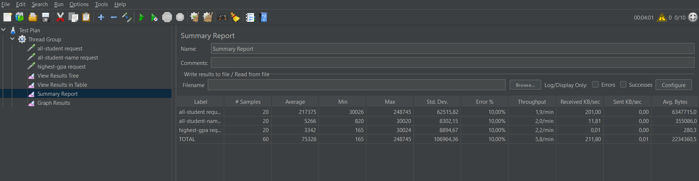
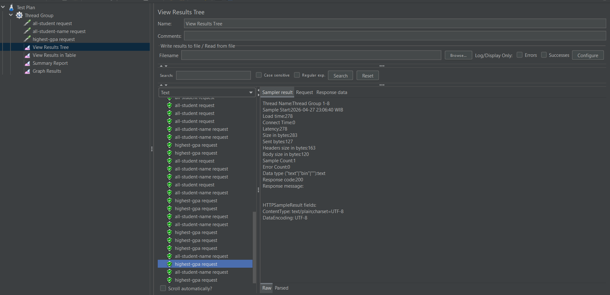
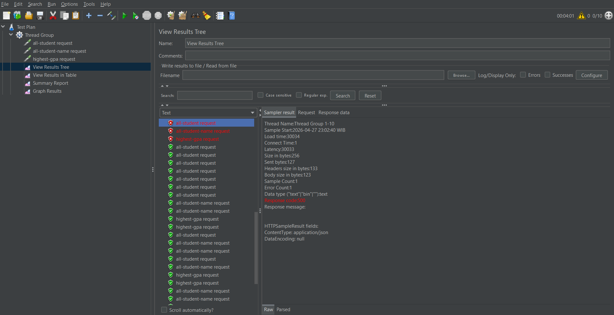
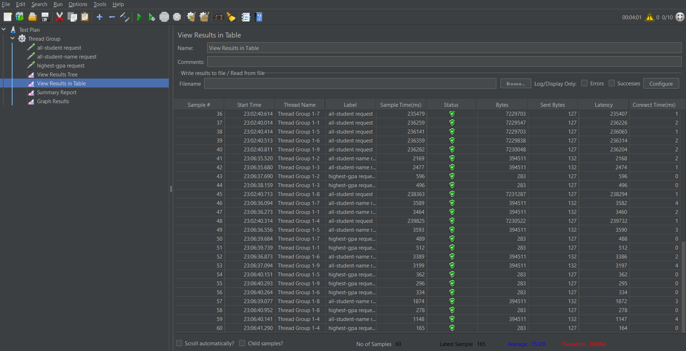
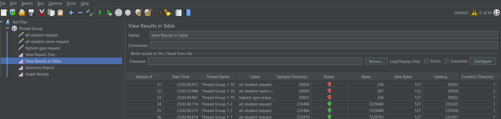
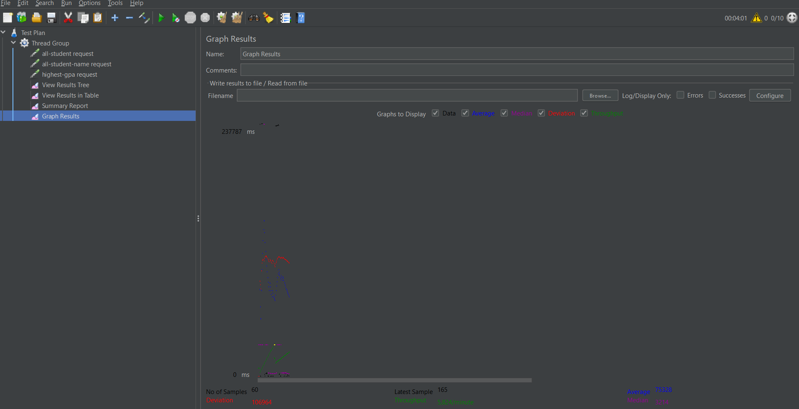
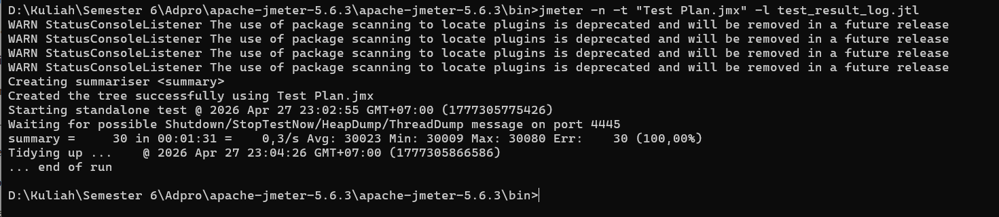
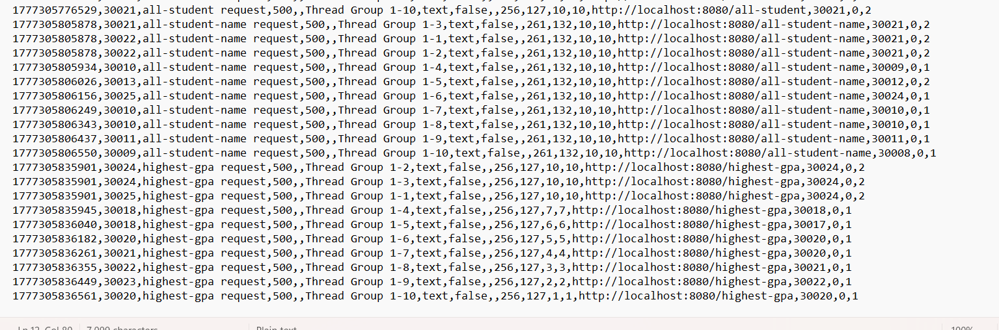

# Performance Testing & Profiling Report

## Deskripsi Project

Pada praktikum ini, dilakukan pengujian performa terhadap sebuah aplikasi berbasis **Spring Boot** yang terhubung dengan database **PostgreSQL**. Aplikasi ini menyediakan beberapa endpoint REST yang digunakan untuk mengambil data mahasiswa dengan berbagai tingkat kompleksitas query.

Tujuan utama dari pengujian ini adalah untuk memahami bagaimana sistem bereaksi ketika menerima banyak request secara bersamaan (*concurrent users*), serta mengidentifikasi bagian mana dari sistem yang menjadi **bottleneck**. Hasil pengujian ini juga digunakan sebagai dasar untuk tahap selanjutnya, yaitu **profiling dan optimasi performa**.

---

## Endpoint yang Diuji

| Endpoint | Deskripsi | Estimasi Beban |
|----------|-----------|-------------|
| `/all-student` | Mengambil **seluruh** data mahasiswa beserta relasinya (JOIN antar tabel) |  Berat |
| `/all-student-name` | Hanya mengambil **nama** mahasiswa tanpa data tambahan |  Ringan |
| `/highest-gpa` | Mencari mahasiswa dengan **GPA tertinggi** (operasi agregasi sederhana) |  Sangat Ringan |

---

## Konfigurasi Pengujian

Pengujian dilakukan menggunakan **Apache JMeter 5.6.3** dengan konfigurasi sebagai berikut:

| Parameter | Nilai |
|-----------|-------|
| Jumlah User (Threads) | 10 |
| Ramp-up Period | 1 detik |
| Loop Count | 1 |
| Total Samples | 60 (20 per endpoint) |

> Konfigurasi ini mensimulasikan kondisi di mana **10 pengguna mengakses sistem secara hampir bersamaan**, yang cukup untuk mengungkap bottleneck pada sistem.

---

## Hasil Pengujian — JMeter GUI

### Summary Report



Berikut adalah data statistik keseluruhan yang diperoleh dari Summary Report:

| Endpoint | # Samples | Average (ms) | Min (ms) | Max (ms) | Std. Dev. | Error % | Throughput |
|----------|-----------|-------------|----------|----------|-----------|---------|------------|
| `all-student` | 20 | **217.375** | 30.026 | 248.745 | 62.515,82 | 10,00% | 1,9/min |
| `all-student-name` | 20 | **5.266** | 820 | 30.020 | 8.302,15 | 10,00% | 2,0/min |
| `highest-gpa` | 20 | **3.342** | 165 | 30.024 | 8.894,67 | 10,00% | 2,2/min |
| **TOTAL** | **60** | **75.328** | **165** | **248.745** | **106.964,36** | **10,00%** | **5,8/min** |

**Analisis:**
- Endpoint `/all-student` menjadi **bottleneck utama** dengan rata-rata waktu respons mencapai **±217 detik** — lebih dari 41x lebih lambat dibanding `/all-student-name`.
- **Error rate 10%** merata di semua endpoint, menandakan ada 2 request per endpoint yang gagal sejak awal (kemungkinan akibat *cold start*).
- **Throughput sangat rendah** — hanya 5,8 request/menit secara total, jauh dari kondisi ideal untuk aplikasi production.
- **Std. Deviation** yang sangat tinggi (terutama `/all-student`: 62.515 ms) menunjukkan **performa yang sangat tidak konsisten**.

---

### View Results Tree

**Bagian 1 — Request awal (Error)**



**Bagian 2 — Request selanjutnya (Sukses)**



Dari tampilan View Results Tree terlihat pola yang sangat jelas:

| Kondisi | Detail |
|---------|--------|
| ❌ **3 request pertama gagal** | `all-student`, `all-student-name`, dan `highest-gpa` dari Thread Group 1-10 mendapat **Response code: 500** |
| ✅ **57 request berikutnya berhasil** | Semua mendapat **Response code: 200** setelah server stabil |
| **Load time request gagal** | ~30.034 ms (30 detik) — server timeout |
| **Load time request sukses** | Serendah **278 ms** untuk `highest-gpa` (Thread Group 1-8) |

**Analisis:** Kegagalan pada 3 request pertama mengindikasikan server mengalami **cold start** — koneksi database atau connection pool belum siap saat request pertama datang secara bersamaan. Setelah inisialisasi selesai, sistem mampu melayani request dengan baik.

---

### View Results in Table

**Bagian 1 — Request awal yang gagal**



**Bagian 2 — Keseluruhan data request**



Data tabel menunjukkan perbandingan performa yang sangat drastis antar endpoint:

| Sample | Label | Sample Time (ms) | Status | Bytes |
|--------|-------|-----------------|--------|-------|
| 31 | `all-student` | 30.034 | ❌ 500 | 256 |
| 32 | `all-student-name` | 30.020 | ❌ 500 | 261 |
| 33 | `highest-gpa` | 30.023 | ❌ 500 | 256 |
| 34–40 | `all-student` | **235.406 – 239.825** | ✅ 200 | ~7.229.480 |
| 41–42 | `all-student-name` | **2.169 – 2.477** | ✅ 200 | 394.511 |
| 43–44 | `highest-gpa` | **496 – 596** | ✅ 200 | 283 |
| 60 | `highest-gpa` | **165** | ✅ 200 | 283 |

**Analisis poin penting:**
- `/all-student` mengembalikan data sebesar **~7 MB per request** — ini penyebab utama kelambatan, karena seluruh data mahasiswa beserta relasinya diambil sekaligus tanpa pagination.
- `/all-student-name` mengembalikan **~394 KB** — jauh lebih efisien.
- `/highest-gpa` hanya mengembalikan **283 bytes** (1 record) — performa sangat baik dengan sample time terbaik **165 ms**.
- Average keseluruhan dataset: **75.338 ms**, Deviation: **106.904 ms** — angka deviasi yang lebih besar dari rata-rata menunjukkan data sangat tersebar (tidak stabil).

---

### Graph Results



Dari grafik terlihat karakteristik performa sistem secara visual:

| Metrik Grafik | Nilai |
|---------------|-------|
| Skala Y tertinggi | **237.787 ms** |
| No of Samples | 60 |
| Latest Sample | 165 ms |
| Average (biru) | ~75.328 ms |
| Deviation (merah) | **106.964** |
| Throughput (hijau) | ~5,8/min |

**Analisis:**
- Titik-titik data sangat **tersebar jauh** dari rata-rata, ditunjukkan oleh garis *Deviation* (merah) yang sangat tinggi.
- Pola grafik memperlihatkan **dua kluster**: request `/all-student` yang berada di kisaran 235.000+ ms (outlier ekstrem) dan endpoint lain yang jauh lebih cepat.
- Garis *Throughput* (hijau) sangat rendah dan mendatar, mengindikasikan **kapasitas sistem yang sangat terbatas**.
- Garis *Average* (biru) berada jauh di atas mayoritas titik data karena didominasi oleh outlier `/all-student`.

---

## Pengujian Menggunakan JMeter CLI

Selain GUI, pengujian dilakukan via **command line** untuk mensimulasikan kondisi beban penuh tanpa interaksi manual:

```bash
jmeter -n -t "Test Plan.jmx" -l test_result_log.jtl
```

### Hasil CLI



Output terminal menunjukkan hasil yang **jauh lebih buruk** dibanding GUI:

```
summary =  30 in 00:01:31 = 0,3/s  Avg: 30023  Min: 30009  Max: 30080  Err: 30 (100,00%)
```

| Metrik | Nilai |
|--------|-------|
| Total Request | 30 |
| Durasi Test | 1 menit 31 detik |
| Throughput | 0,3 request/detik |
| Rata-rata Waktu Respons | 30.023 ms |
| Minimum Waktu Respons | 30.009 ms |
| Maximum Waktu Respons | 30.080 ms |
| **Error Rate** | ❌ **100% (30/30 request gagal)** |

**Analisis:** Semua 30 request mengalami **timeout (~30 detik)** dan gagal dengan status 500. Min dan Max yang hampir sama (30.009 – 30.080 ms) menunjukkan seluruh request "menunggu" hingga batas timeout, bukan diproses sama sekali oleh server.

---

### File Log JTL



File log `.jtl` (CSV format) mengkonfirmasi kegagalan total. Setiap baris menunjukkan:

```
timestamp, elapsed, label, responseCode, responseMessage, threadName, ...
1777305776529, 30021, all-student request,    500, , Thread Group 1-10, ..., http://localhost:8080/all-student,    30021, 0, 2
1777305805878, 30021, all-student-name request, 500, , Thread Group 1-3, ..., http://localhost:8080/all-student-name, 30021, 0, 2
1777305835901, 30024, highest-gpa request,    500, , Thread Group 1-2, ..., http://localhost:8080/highest-gpa,    30024, 0, 2
```

Seluruh endpoint mengembalikan **status 500** dengan elapsed time **~30 detik** — mengindikasikan server crash atau tidak responsif saat menerima beban CLI.

**Perbandingan GUI vs CLI:**

| Aspek | JMeter GUI | JMeter CLI |
|-------|-----------|------------|
| Cara eksekusi | Bertahap dengan overhead rendering UI | Langsung serentak tanpa buffer |
| Error Rate | 10% (3 dari 60 request) | ❌ **100% (30 dari 30)** |
| Avg Response Time | 75.328 ms | 30.023 ms (semua timeout) |
| Throughput | 5,8/min | 0,3 req/detik |
| Penyebab | UI rendering memberi jeda alami | Semua thread firing simultan |

---

##  Analisis Masalah

Berdasarkan seluruh data pengujian, ditemukan beberapa *root cause* permasalahan:

### 1.  Unoptimized Query & Data Overfetching pada `/all-student`
Endpoint ini mengembalikan **~7 MB data** per request, mengindikasikan query yang tidak efisien — kemungkinan melakukan `JOIN` besar atau lazy loading yang memicu banyak query ke database secara berantai (N+1 problem). Rata-rata **217 detik** adalah angka yang tidak bisa diterima untuk production.

### 2. Cold Start / Connection Pool Belum Siap
Tiga request pertama dari ketiga endpoint semuanya gagal dengan timeout 30 detik. Ini mengindikasikan **connection pool database belum ter-inisialisasi** dengan baik saat traffic tiba bersamaan di awal test.

### 3. Server Overload pada Beban Penuh (CLI = 100% Error)
Error rate 100% pada mode CLI menunjukkan aplikasi tidak memiliki mekanisme **rate limiting**, **circuit breaker**, atau **async processing** yang memadai untuk menangani lonjakan traffic secara tiba-tiba.

### 4. Tidak Ada Pagination
Data `/all-student` mengembalikan **seluruh record** sekaligus (~7 MB). Tanpa pagination, performa akan terus memburuk seiring bertambahnya data di database.

---

##  Kesimpulan

| Aspek | Temuan |
|-------|--------|
| Bottleneck utama | `/all-student` — avg. 217 detik, data 7 MB/request |
| Stabilitas sistem | Tidak stabil — error 10% (GUI), 100% (CLI) |
| Throughput total | Sangat rendah (5,8 req/menit GUI) |
| Request tercepat | `/highest-gpa` — 165 ms (best case) |
| Kesiapan production | ❌ Belum siap untuk concurrent load |

---