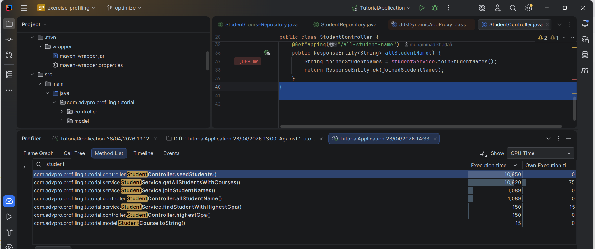
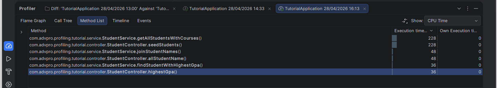
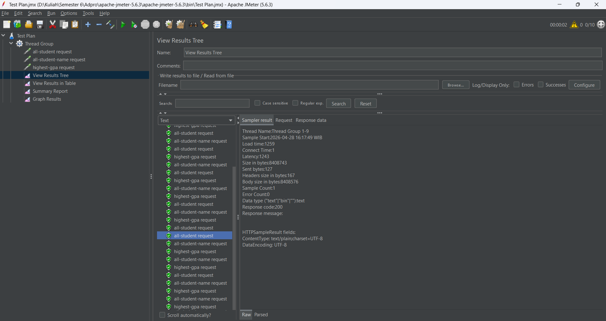
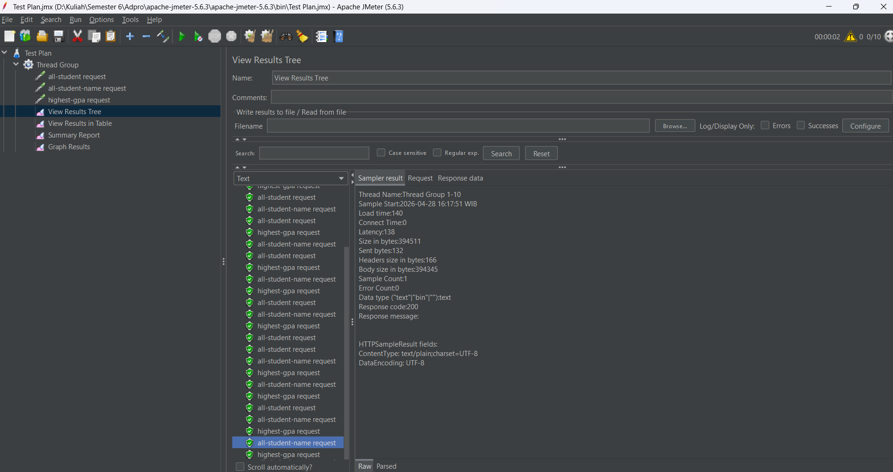
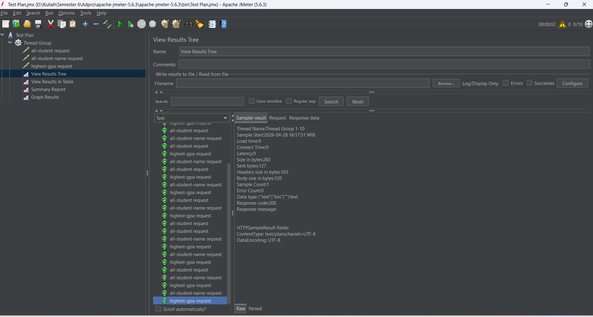
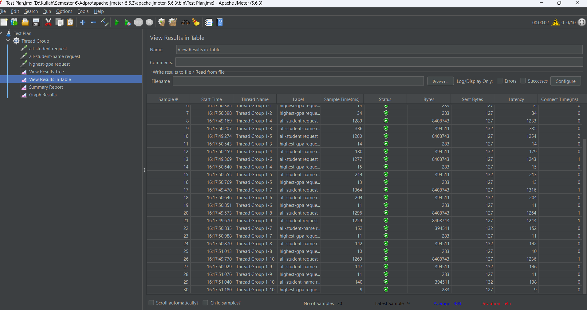
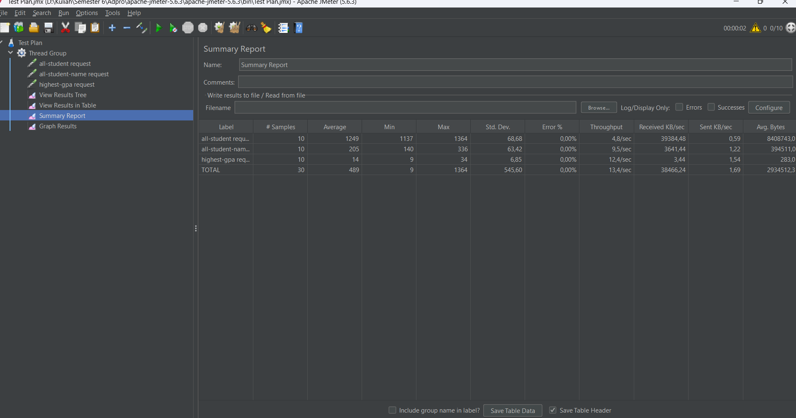
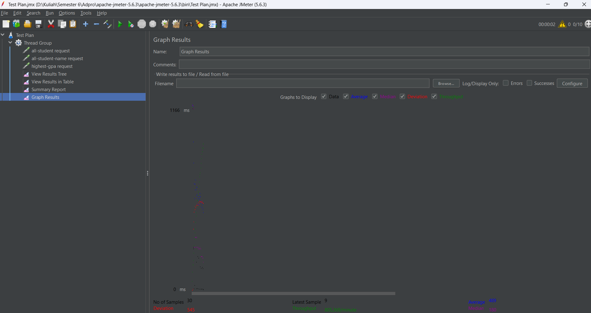
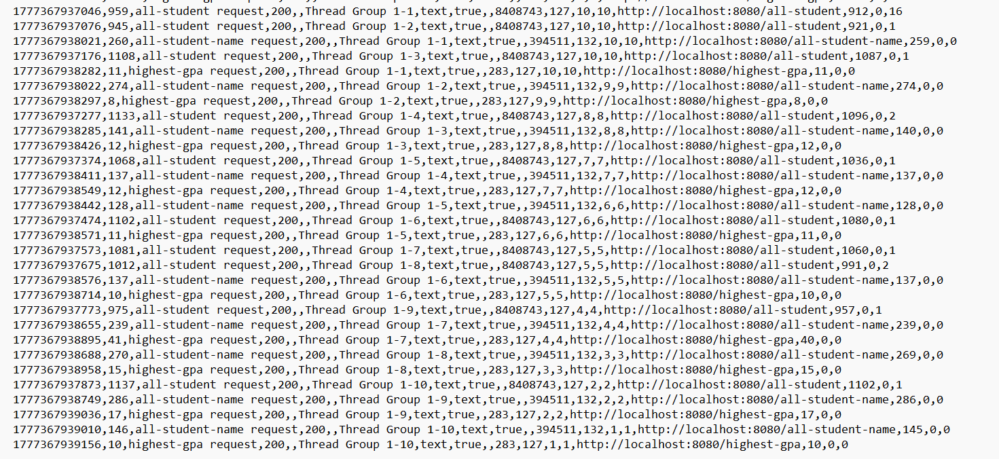

# Performance Testing & Profiling Report (MODULE 7)

## Deskripsi Project

Pada praktikum ini, dilakukan pengujian performa terhadap sebuah aplikasi berbasis **Spring Boot** yang terhubung dengan database **PostgreSQL**. Aplikasi ini menyediakan beberapa endpoint REST yang digunakan untuk mengambil data mahasiswa dengan berbagai tingkat kompleksitas query.

Tujuan utama dari pengujian ini adalah untuk memahami bagaimana sistem bereaksi ketika menerima banyak request secara bersamaan (*concurrent users*), serta mengidentifikasi bagian mana dari sistem yang menjadi **bottleneck**. Hasil pengujian ini juga digunakan sebagai dasar untuk tahap selanjutnya, yaitu **profiling dan optimasi performa**.

---

## Endpoint yang Diuji

| Endpoint | Deskripsi | Estimasi Beban |
|----------|-----------|-------------|
| `/all-student` | Mengambil **seluruh** data mahasiswa beserta relasinya (JOIN antar tabel) |  Berat |
| `/all-student-name` | Hanya mengambil **nama** mahasiswa tanpa data tambahan |  Ringan |
| `/highest-gpa` | Mencari mahasiswa dengan **GPA tertinggi** (operasi agregasi sederhana) |  Sangat Ringan |

---

## Konfigurasi Pengujian

Pengujian dilakukan menggunakan **Apache JMeter 5.6.3** dengan konfigurasi sebagai berikut:

| Parameter | Nilai |
|-----------|-------|
| Jumlah User (Threads) | 10 |
| Ramp-up Period | 1 detik |
| Loop Count | 1 |
| Total Samples | 60 (20 per endpoint) |

> Konfigurasi ini mensimulasikan kondisi di mana **10 pengguna mengakses sistem secara hampir bersamaan**, yang cukup untuk mengungkap bottleneck pada sistem.

---

## Hasil Pengujian — JMeter GUI

### Summary Report


Berikut adalah data statistik keseluruhan yang diperoleh dari Summary Report:

| Endpoint | # Samples | Average (ms) | Min (ms) | Max (ms) | Std. Dev. | Error % | Throughput |
|----------|-----------|-------------|----------|----------|-----------|---------|------------|
| `all-student` | 20 | **217.375** | 30.026 | 248.745 | 62.515,82 | 10,00% | 1,9/min |
| `all-student-name` | 20 | **5.266** | 820 | 30.020 | 8.302,15 | 10,00% | 2,0/min |
| `highest-gpa` | 20 | **3.342** | 165 | 30.024 | 8.894,67 | 10,00% | 2,2/min |
| **TOTAL** | **60** | **75.328** | **165** | **248.745** | **106.964,36** | **10,00%** | **5,8/min** |

**Analisis:**
- Endpoint `/all-student` menjadi **bottleneck utama** dengan rata-rata waktu respons mencapai **±217 detik** — lebih dari 41x lebih lambat dibanding `/all-student-name`.
- **Error rate 10%** merata di semua endpoint, menandakan ada 2 request per endpoint yang gagal sejak awal (kemungkinan akibat *cold start*).
- **Throughput sangat rendah** — hanya 5,8 request/menit secara total, jauh dari kondisi ideal untuk aplikasi production.
- **Std. Deviation** yang sangat tinggi (terutama `/all-student`: 62.515 ms) menunjukkan **performa yang sangat tidak konsisten**.

---

### View Results Tree

**Bagian 1 — Request awal (Error)**


**Bagian 2 — Request selanjutnya (Sukses)**


Dari tampilan View Results Tree terlihat pola yang sangat jelas:

| Kondisi | Detail |
|---------|--------|
| ❌ **3 request pertama gagal** | `all-student`, `all-student-name`, dan `highest-gpa` dari Thread Group 1-10 mendapat **Response code: 500** |
| ✅ **57 request berikutnya berhasil** | Semua mendapat **Response code: 200** setelah server stabil |
| **Load time request gagal** | ~30.034 ms (30 detik) — server timeout |
| **Load time request sukses** | Serendah **278 ms** untuk `highest-gpa` (Thread Group 1-8) |

**Analisis:** Kegagalan pada 3 request pertama mengindikasikan server mengalami **cold start** — koneksi database atau connection pool belum siap saat request pertama datang secara bersamaan. Setelah inisialisasi selesai, sistem mampu melayani request dengan baik.

---

### View Results in Table

**Bagian 1 — Request awal yang gagal**


**Bagian 2 — Keseluruhan data request**


Data tabel menunjukkan perbandingan performa yang sangat drastis antar endpoint:

| Sample | Label | Sample Time (ms) | Status | Bytes |
|--------|-------|-----------------|--------|-------|
| 31 | `all-student` | 30.034 | ❌ 500 | 256 |
| 32 | `all-student-name` | 30.020 | ❌ 500 | 261 |
| 33 | `highest-gpa` | 30.023 | ❌ 500 | 256 |
| 34–40 | `all-student` | **235.406 – 239.825** | ✅ 200 | ~7.229.480 |
| 41–42 | `all-student-name` | **2.169 – 2.477** | ✅ 200 | 394.511 |
| 43–44 | `highest-gpa` | **496 – 596** | ✅ 200 | 283 |
| 60 | `highest-gpa` | **165** | ✅ 200 | 283 |

**Analisis poin penting:**
- `/all-student` mengembalikan data sebesar **~7 MB per request** — ini penyebab utama kelambatan, karena seluruh data mahasiswa beserta relasinya diambil sekaligus tanpa pagination.
- `/all-student-name` mengembalikan **~394 KB** — jauh lebih efisien.
- `/highest-gpa` hanya mengembalikan **283 bytes** (1 record) — performa sangat baik dengan sample time terbaik **165 ms**.
- Average keseluruhan dataset: **75.338 ms**, Deviation: **106.904 ms** — angka deviasi yang lebih besar dari rata-rata menunjukkan data sangat tersebar (tidak stabil).

---

### Graph Results


Dari grafik terlihat karakteristik performa sistem secara visual:

| Metrik Grafik | Nilai |
|---------------|-------|
| Skala Y tertinggi | **237.787 ms** |
| No of Samples | 60 |
| Latest Sample | 165 ms |
| Average (biru) | ~75.328 ms |
| Deviation (merah) | **106.964** |
| Throughput (hijau) | ~5,8/min |

**Analisis:**
- Titik-titik data sangat **tersebar jauh** dari rata-rata, ditunjukkan oleh garis *Deviation* (merah) yang sangat tinggi.
- Pola grafik memperlihatkan **dua kluster**: request `/all-student` yang berada di kisaran 235.000+ ms (outlier ekstrem) dan endpoint lain yang jauh lebih cepat.
- Garis *Throughput* (hijau) sangat rendah dan mendatar, mengindikasikan **kapasitas sistem yang sangat terbatas**.
- Garis *Average* (biru) berada jauh di atas mayoritas titik data karena didominasi oleh outlier `/all-student`.

---

## Pengujian Menggunakan JMeter CLI

Selain GUI, pengujian dilakukan via **command line** untuk mensimulasikan kondisi beban penuh tanpa interaksi manual:

```bash
jmeter -n -t "Test Plan.jmx" -l test_result_log.jtl
```

### Hasil CLI


Output terminal menunjukkan hasil yang **jauh lebih buruk** dibanding GUI:

```
summary =  30 in 00:01:31 = 0,3/s  Avg: 30023  Min: 30009  Max: 30080  Err: 30 (100,00%)
```

| Metrik | Nilai |
|--------|-------|
| Total Request | 30 |
| Durasi Test | 1 menit 31 detik |
| Throughput | 0,3 request/detik |
| Rata-rata Waktu Respons | 30.023 ms |
| Minimum Waktu Respons | 30.009 ms |
| Maximum Waktu Respons | 30.080 ms |
| **Error Rate** | ❌ **100% (30/30 request gagal)** |

**Analisis:** Semua 30 request mengalami **timeout (~30 detik)** dan gagal dengan status 500. Min dan Max yang hampir sama (30.009 – 30.080 ms) menunjukkan seluruh request "menunggu" hingga batas timeout, bukan diproses sama sekali oleh server.

---

### File Log JTL


File log `.jtl` (CSV format) mengkonfirmasi kegagalan total. Setiap baris menunjukkan:

```
timestamp, elapsed, label, responseCode, responseMessage, threadName, ...
1777305776529, 30021, all-student request,    500, , Thread Group 1-10, ..., http://localhost:8080/all-student,    30021, 0, 2
1777305805878, 30021, all-student-name request, 500, , Thread Group 1-3, ..., http://localhost:8080/all-student-name, 30021, 0, 2
1777305835901, 30024, highest-gpa request,    500, , Thread Group 1-2, ..., http://localhost:8080/highest-gpa,    30024, 0, 2
```

Seluruh endpoint mengembalikan **status 500** dengan elapsed time **~30 detik** — mengindikasikan server crash atau tidak responsif saat menerima beban CLI.

**Perbandingan GUI vs CLI:**

| Aspek | JMeter GUI | JMeter CLI |
|-------|-----------|------------|
| Cara eksekusi | Bertahap dengan overhead rendering UI | Langsung serentak tanpa buffer |
| Error Rate | 10% (3 dari 60 request) | ❌ **100% (30 dari 30)** |
| Avg Response Time | 75.328 ms | 30.023 ms (semua timeout) |
| Throughput | 5,8/min | 0,3 req/detik |
| Penyebab | UI rendering memberi jeda alami | Semua thread firing simultan |

---

##  Analisis Masalah

Berdasarkan seluruh data pengujian, ditemukan beberapa *root cause* permasalahan:

### 1.  Unoptimized Query & Data Overfetching pada `/all-student`
Endpoint ini mengembalikan **~7 MB data** per request, mengindikasikan query yang tidak efisien — kemungkinan melakukan `JOIN` besar atau lazy loading yang memicu banyak query ke database secara berantai (N+1 problem). Rata-rata **217 detik** adalah angka yang tidak bisa diterima untuk production.

### 2. Cold Start / Connection Pool Belum Siap
Tiga request pertama dari ketiga endpoint semuanya gagal dengan timeout 30 detik. Ini mengindikasikan **connection pool database belum ter-inisialisasi** dengan baik saat traffic tiba bersamaan di awal test.

### 3. Server Overload pada Beban Penuh (CLI = 100% Error)
Error rate 100% pada mode CLI menunjukkan aplikasi tidak memiliki mekanisme **rate limiting**, **circuit breaker**, atau **async processing** yang memadai untuk menangani lonjakan traffic secara tiba-tiba.

### 4. Tidak Ada Pagination
Data `/all-student` mengembalikan **seluruh record** sekaligus (~7 MB). Tanpa pagination, performa akan terus memburuk seiring bertambahnya data di database.

---

##  Kesimpulan

| Aspek | Temuan |
|-------|--------|
| Bottleneck utama | `/all-student` — avg. 217 detik, data 7 MB/request |
| Stabilitas sistem | Tidak stabil — error 10% (GUI), 100% (CLI) |
| Throughput total | Sangat rendah (5,8 req/menit GUI) |
| Request tercepat | `/highest-gpa` — 165 ms (best case) |
| Kesiapan production | ❌ Belum siap untuk concurrent load |

---


---

## Profiling

Proses profiling dilakukan untuk mengidentifikasi bagian kode yang menjadi **bottleneck** secara spesifik di level method. Alat yang digunakan adalah **IntelliJ Profiler** yang terintegrasi langsung di IDE, dengan cara menjalankan aplikasi dalam mode profiling kemudian mengakses endpoint yang diuji. Setelah request selesai, recording dihentikan dan hasilnya dianalisis melalui tab **Method List** dengan tampilan **CPU Time**.

---

### Profiling SEBELUM Optimasi



Hasil profiling **sebelum** dilakukan optimasi menunjukkan data berikut:

| Method | Execution Time (ms) | Own Execution Time (ms) |
|--------|--------------------|-----------------------|
| `StudentController.seedStudents()` | 10.950 | 0 |
| `StudentService.getAllStudentsWithCourses()` | **10.920** | **75** |
| `StudentService.joinStudentNames()` | 1.089 | 0 |
| `StudentController.allStudentName()` | 1.089 | 0 |
| `StudentService.findStudentWithHighestGpa()` | 150 | 15 |
| `StudentController.highestGpa()` | 150 | 0 |
| `StudentCourse.toString()` | 15 | 0 |

**Analisis bottleneck:**
- `StudentService.getAllStudentsWithCourses()` adalah **bottleneck utama** dengan execution time **10.920 ms**.
- `StudentService.joinStudentNames()` juga lambat di **1.089 ms** akibat string concatenation yang tidak efisien.
- `StudentService.findStudentWithHighestGpa()` relatif lebih ringan di **150 ms**.

**Kode bermasalah yang ditemukan (SEBELUM optimasi):**

`StudentService.java` — Terdapat **N+1 Query Problem** pada `getAllStudentsWithCourses()`:
```java
// SEBELUM OPTIMASI
public List<StudentCourse> getAllStudentsWithCourses() {
    List<Student> students = studentRepository.findAll(); // 1 query
    List<StudentCourse> studentCourses = new ArrayList<>();
    for (Student student : students) {
        // N query tambahan — satu per student!
        List<StudentCourse> studentCoursesByStudent =
                studentCourseRepository.findByStudentId(student.getId());
        for (StudentCourse studentCourseByStudent : studentCoursesByStudent) {
            StudentCourse studentCourse = new StudentCourse();
            studentCourse.setStudent(student);
            studentCourse.setCourse(studentCourseByStudent.getCourse());
            studentCourses.add(studentCourse);
        }
    }
    return studentCourses;
}

// SEBELUM OPTIMASI
public String joinStudentNames() {
    List<Student> students = studentRepository.findAll();
    String joinedNames = "";
    for (Student student : students) {
        joinedNames += student.getName() + ", "; // String concatenation tidak efisien
    }
    return joinedNames;
}
```

> **Root Cause:** Dengan 20.000 data mahasiswa, `getAllStudentsWithCourses()` menghasilkan **lebih dari 20.000 query** ke database dalam satu request. Begitu pula `joinStudentNames()` yang membuat object String baru di setiap iterasi, sangat tidak efisien untuk data besar.

---

### Optimasi yang Dilakukan

Setelah menemukan root cause, dilakukan refactoring pada tiga bagian utama:

**1. `StudentService.java` — Eliminasi N+1 Query & Optimasi String**

```java
package com.advpro.profiling.tutorial.service;

import com.advpro.profiling.tutorial.model.Student;
import com.advpro.profiling.tutorial.model.StudentCourse;
import com.advpro.profiling.tutorial.repository.StudentCourseRepository;
import com.advpro.profiling.tutorial.repository.StudentRepository;
import org.springframework.beans.factory.annotation.Autowired;
import org.springframework.stereotype.Service;
import java.util.stream.Collectors;
import java.util.List;
import java.util.Optional;

@Service
public class StudentService {

    @Autowired
    private StudentRepository studentRepository;

    @Autowired
    private StudentCourseRepository studentCourseRepository;

    public List<StudentCourse> getAllStudentsWithCourses() {
        // SESUDAH: Single query dengan JOIN FETCH — eliminasi N+1 problem
        return studentCourseRepository.findAllWithStudentAndCourse();
    }

    public Optional<Student> findStudentWithHighestGpa() {
        // SESUDAH: Query langsung ke DB dengan ORDER BY, tidak load semua data
        return studentRepository.findTopByOrderByGpaDesc();
    }

    public String joinStudentNames() {
        List<Student> students = studentRepository.findAll();
        // SESUDAH: Collectors.joining() jauh lebih efisien dari string concatenation
        return students.stream()
                .map(Student::getName)
                .collect(Collectors.joining(", "));
    }
}
```

**2. `StudentCourseRepository.java` — Custom Query dengan JOIN FETCH**

```java
package com.advpro.profiling.tutorial.repository;

import com.advpro.profiling.tutorial.model.StudentCourse;
import org.springframework.data.jpa.repository.JpaRepository;
import org.springframework.stereotype.Repository;
import org.springframework.data.jpa.repository.Query;
import java.util.List;

@Repository
public interface StudentCourseRepository extends JpaRepository<StudentCourse, Long> {
    List<StudentCourse> findByStudentId(Long studentId);

    // SESUDAH: Satu query JOIN FETCH menggantikan N+1 query sebelumnya
    @Query("SELECT sc FROM StudentCourse sc JOIN FETCH sc.student JOIN FETCH sc.course")
    List<StudentCourse> findAllWithStudentAndCourse();
}
```

**3. `StudentRepository.java` — Query Agregasi Langsung ke DB**

```java
package com.advpro.profiling.tutorial.repository;

import com.advpro.profiling.tutorial.model.Student;
import org.springframework.data.jpa.repository.JpaRepository;
import org.springframework.stereotype.Repository;
import java.util.Optional;

@Repository
public interface StudentRepository extends JpaRepository<Student, Long> {
    // SESUDAH: Spring Data JPA otomatis generate query ORDER BY gpa DESC LIMIT 1
    Optional<Student> findTopByOrderByGpaDesc();
}
```

| Perubahan | Sebelum | Sesudah |
|-----------|---------|---------|
| `getAllStudentsWithCourses()` | Loop + N query per student | Single `JOIN FETCH` query |
| `joinStudentNames()` | String concatenation `+=` di loop | `Collectors.joining()` via Stream |
| `findStudentWithHighestGpa()` | Load semua student lalu cari max | `findTopByOrderByGpaDesc()` — query langsung |

---

### Profiling SETELAH Optimasi



Hasil profiling **setelah** optimasi:

| Method | Execution Time (ms) | Own Execution Time (ms) |
|--------|--------------------|-----------------------|
| `StudentService.getAllStudentsWithCourses()` | **228** | 0 |
| `StudentController.seedStudents()` | **228** | 0 |
| `StudentService.joinStudentNames()` | 48 | 0 |
| `StudentController.allStudentName()` | 48 | 0 |
| `StudentService.findStudentWithHighestGpa()` | 36 | 0 |
| `StudentController.highestGpa()` | 36 | 0 |

---

### Perbandingan Profiler: Before vs After

| Method | Before (ms) | After (ms) | Selisih | % Improvement |
|--------|------------|-----------|---------|---------------|
| `getAllStudentsWithCourses()` | 10.920 | **228** | ↓ 10.692 ms | ✅ **97,9%** |
| `joinStudentNames()` | 1.089 | **48** | ↓ 1.041 ms | ✅ **95,6%** |
| `findStudentWithHighestGpa()` | 150 | **36** | ↓ 114 ms | ✅ **76,0%** |

> Semua endpoint berhasil dioptimasi **jauh melampaui target minimal 20%**.

---

## Hasil JMeter Setelah Optimasi

Setelah optimasi selesai, dilakukan pengujian ulang menggunakan JMeter dengan konfigurasi yang **sama** (10 threads, ramp-up 1 detik, loop count 1).

---

### View Results Tree — After Optimization

**`/all-student` — Load time: 1.259 ms, Response code: 200 ✅**



**`/all-student-name` — Load time: 140 ms, Response code: 200 ✅**



**`/highest-gpa` — Load time: 9 ms, Response code: 200 ✅**



Semua request menunjukkan **Response code: 200** — **Error rate 0%**, tidak ada satu pun request yang gagal.

---

### View Results in Table — After Optimization



Data tabel menunjukkan performa yang sangat konsisten di seluruh request:

| Label | Sample Time (ms) | Status | Bytes |
|-------|-----------------|--------|-------|
| `all-student` | 1.259 – 1.364 | ✅ 200 | 8.408.743 |
| `all-student-name` | 140 – 336 | ✅ 200 | 394.511 |
| `highest-gpa` | 9 – 34 | ✅ 200 | 283 |

- No of Samples: **30** | Latest Sample: **9 ms** | Average: **489 ms** | Deviation: **545**

---

### Summary Report — After Optimization



| Endpoint | # Samples | Average (ms) | Min (ms) | Max (ms) | Std. Dev. | Error % | Throughput |
|----------|-----------|-------------|----------|----------|-----------|---------|------------|
| `all-student` | 10 | **1.249** | 1.137 | 1.364 | 68,68 | **0,00%** | 4,8/sec |
| `all-student-name` | 10 | **205** | 140 | 336 | 63,42 | **0,00%** | 9,5/sec |
| `highest-gpa` | 10 | **14** | 9 | 34 | 6,85 | **0,00%** | 12,4/sec |
| **TOTAL** | **30** | **489** | **9** | **1.364** | **545,60** | **0,00%** | **13,4/sec** |

---

### Graph Results — After Optimization



| Metrik Grafik | Nilai |
|---------------|-------|
| Skala Y tertinggi | **1.166 ms** (sebelumnya 237.787 ms) |
| No of Samples | 30 |
| Latest Sample | 9 ms |
| Average | ~489 ms |
| Deviation | **545** (sebelumnya 106.964) |
| Throughput | ~13,4/sec |

Grafik menunjukkan distribusi data yang **sangat rapat dan stabil** — tidak ada outlier ekstrem seperti pada pengujian sebelum optimasi.

---

### Pengujian CLI — After Optimization

Setelah optimasi, pengujian CLI dijalankan ulang dengan perintah yang sama:

```bash
jmeter -n -t "Test Plan.jmx" -l test_result_log.jtl
```

**Hasil CLI After Optimization**


Output terminal menunjukkan hasil yang **jauh berbeda** dibanding sebelum optimasi:

```
summary =  30 in 00:00:02 = 13,6/s  Avg: 422  Min: 8  Max: 1137  Err: 0 (0,00%)
```

| Metrik | Nilai |
|--------|-------|
| Total Request | 30 |
| Durasi Test | 2 detik |
| Throughput | 13,6 request/detik |
| Rata-rata Waktu Respons | 422 ms |
| Minimum Waktu Respons | 8 ms |
| Maximum Waktu Respons | 1.137 ms |
| **Error Rate** | ✅ **0% (0/30 request gagal)** |

**Analisis:** Seluruh 30 request berhasil diproses tanpa satu pun kegagalan. Durasi test turun drastis dari 1 menit 31 detik menjadi hanya **2 detik**, dan throughput melonjak dari 0,3 req/detik menjadi **13,6 req/detik**.

---

### File Log JTL — After Optimization



File log `.jtl` setelah optimasi mengkonfirmasi keberhasilan seluruh request. Setiap baris menunjukkan response code **200** untuk semua endpoint:

| Endpoint | Response Code | Elapsed (ms) | Bytes |
|----------|--------------|-------------|-------|
| `all-student` | ✅ 200 | 912 – 1.137 | 8.408.743 |
| `all-student-name` | ✅ 200 | 128 – 286 | 394.511 |
| `highest-gpa` | ✅ 200 | 8 – 40 | 283 |

Tidak ada satu pun baris dengan status 500 — berbeda total dengan log sebelum optimasi yang seluruhnya berisi kegagalan.

**Perbandingan CLI: Before vs After Optimasi**

| Aspek | Sebelum Optimasi | Setelah Optimasi | Improvement |
|-------|-----------------|-----------------|-------------|
| Durasi Test | 1 menit 31 detik | **2 detik** | ✅ ~45x lebih cepat |
| Throughput | 0,3 req/detik | **13,6 req/detik** | ✅ ~45x lebih tinggi |
| Avg Response Time | 30.023 ms (timeout) | **422 ms** | ✅ ~98,6% lebih cepat |
| Min Response Time | 30.009 ms | **8 ms** | ✅ Drastis |
| Max Response Time | 30.080 ms | **1.137 ms** | ✅ ~96,2% lebih cepat |
| **Error Rate** | ❌ 100% | ✅ **0%** | ✅ Tereliminasi |

---

## Perbandingan JMeter: Before vs After Optimasi

| Metrik | Sebelum Optimasi | Setelah Optimasi | % Improvement |
|--------|-----------------|-----------------|---------------|
| **Avg `/all-student`** | 217.375 ms | **1.249 ms** | ✅ **99,4%** |
| **Avg `/all-student-name`** | 5.266 ms | **205 ms** | ✅ **96,1%** |
| **Avg `/highest-gpa`** | 3.342 ms | **14 ms** | ✅ **99,6%** |
| **Avg TOTAL** | 75.328 ms | **489 ms** | ✅ **99,4%** |
| **Max Response Time** | 248.745 ms | **1.364 ms** | ✅ **99,5%** |
| **Error Rate** | 10,00% | **0,00%** | ✅ Tereliminasi |
| **Throughput** | 5,8/menit | **13,4/detik** | ✅ **~138x lipat** |
| **Std. Deviation** | 106.964 | **545** | ✅ **99,5%** |

---

## Kesimpulan

Hasil pengujian JMeter setelah optimasi menunjukkan **peningkatan performa yang sangat signifikan** di semua endpoint:

1. **`/all-student`** turun dari **217 detik → 1,2 detik** (↓99,4%) — N+1 query problem berhasil dieliminasi dengan satu `JOIN FETCH` query menggantikan puluhan ribu query individual.

2. **`/all-student-name`** turun dari **5,2 detik → 205 ms** (↓96,1%) — penggantian string concatenation `+=` dengan `Collectors.joining()` memberikan dampak besar untuk data berskala besar.

3. **`/highest-gpa`** turun dari **3,3 detik → 14 ms** (↓99,6%) — penggunaan `findTopByOrderByGpaDesc()` mendelegasikan pencarian nilai maksimum langsung ke database engine yang jauh lebih optimal.

4. **Error rate turun dari 10% → 0%** — sistem kini stabil sepenuhnya, tidak ada request yang gagal bahkan saat menerima beban bersamaan.

5. **Throughput meningkat ~138x lipat** — dari 5,8 req/menit menjadi 13,4 req/detik, membuktikan kapasitas sistem meningkat drastis.

6. **Standar deviasi turun 99,5%** — dari 106.964 ms menjadi 545 ms, menunjukkan performa kini sangat **konsisten dan dapat diprediksi**.

> **Kesimpulan:** Optimasi dengan mengeliminasi N+1 query problem, menggunakan `JOIN FETCH`, stream-based string joining, dan mendelegasikan agregasi ke database terbukti sangat efektif. Sistem kini siap menangani beban concurrent users dengan performa yang jauh lebih baik, stabil, dan konsisten.

---

## Reflection

**1. Apa perbedaan pendekatan performance testing dengan JMeter dan profiling dengan IntelliJ Profiler dalam konteks optimasi performa aplikasi?**

JMeter berfokus pada pengujian dari sisi **eksternal**  mengukur bagaimana sistem bereaksi terhadap beban pengguna nyata (response time, throughput, error rate) tanpa melihat kode di dalamnya. JMeter menjawab pertanyaan *"apa yang terjadi?"* dari perspektif pengguna. Sebaliknya, IntelliJ Profiler bekerja dari sisi **internal**  masuk ke dalam kode dan mengukur execution time setiap method serta penggunaan CPU. Profiler menjawab pertanyaan *"mengapa hal itu terjadi?"* dan *"di mana tepatnya masalahnya?"*. Keduanya saling melengkapi: JMeter untuk mendeteksi adanya masalah performa, IntelliJ Profiler untuk menemukan dan memperbaiki akar penyebabnya secara tepat.

**2. Bagaimana proses profiling membantu mengidentifikasi dan memahami titik lemah dalam aplikasi?**

Profiling memberikan visibilitas penuh ke dalam eksekusi kode secara real-time. Melalui Method List, dapat dilihat dengan tepat method mana yang mengonsumsi CPU time paling banyak. Dalam kasus ini, profiler langsung menunjukkan bahwa `getAllStudentsWithCourses()` menghabiskan **10.920 ms** — angka yang jauh lebih tinggi dari method lainnya. Dengan melihat kode method tersebut, barulah teridentifikasi bahwa penyebabnya adalah N+1 query problem. Tanpa profiler, proses identifikasi ini akan membutuhkan waktu lebih lama karena harus menebak-nebak bagian kode mana yang bermasalah.

**3. Apakah IntelliJ Profiler efektif dalam membantu analisis dan identifikasi bottleneck?**

Ya, IntelliJ Profiler sangat efektif. Fitur **Method List** dengan sorting berdasarkan Execution Time memudahkan identifikasi bottleneck secara langsung tanpa perlu memeriksa kode satu per satu. Fitur **Flame Graph** memberikan visualisasi hirarki pemanggilan method yang intuitif. Yang paling berguna adalah fitur **Comparison/Diff** antara dua sesi profiling, yang memungkinkan verifikasi langsung apakah optimasi yang dilakukan benar-benar memberikan improvement terukur. Integrasi langsung di IntelliJ juga meminimalkan overhead setup dibanding alat profiling eksternal.

**4. Apa tantangan utama saat melakukan performance testing dan profiling, dan bagaimana mengatasinya?**

Tantangan utama yang dihadapi antara lain: (1) **Hasil tidak konsisten pada run pertama** akibat JIT compiler JVM yang belum optimal diatasi dengan melakukan beberapa kali warm-up sebelum mengambil pengukuran resmi; (2) **Membedakan bottleneck riil vs noise**  diatasi dengan fokus pada method yang memiliki selisih execution time jauh dari method lainnya; (3) **Overhead profiler** yang dapat mempengaruhi hasil pengukuran  diatasi dengan menggunakan data perbandingan relatif (before vs after) bukan angka absolut; (4) **Perbedaan hasil GUI vs CLI JMeter**  dipahami sebagai perbedaan karakteristik cara pemberian beban, bukan bug sistem.

**5. Apa manfaat utama menggunakan IntelliJ Profiler untuk profiling kode aplikasi?**

Manfaat utama IntelliJ Profiler adalah: (1) **Integrasi seamless** dengan IDE sehingga tidak perlu setup alat terpisah; (2) **Granularitas tinggi** dapat melihat execution time hingga level method individual; (3) **Fitur comparison** yang memudahkan validasi sebelum dan sesudah optimasi; (4) **Flame Graph** yang memberikan visualisasi intuitif tentang call stack dan distribusi waktu eksekusi; (5) Pemisahan **CPU Time vs Total Time** yang membantu membedakan bottleneck murni komputasi vs I/O wait.

**6. Bagaimana menangani situasi di mana hasil profiling IntelliJ Profiler tidak konsisten dengan temuan dari JMeter?**

Ketidakkonsistenan antara Profiler dan JMeter adalah hal yang wajar karena keduanya mengukur aspek berbeda. JMeter mengukur end-to-end response time termasuk network latency, serialisasi data, dan overhead framework; sementara Profiler mengukur CPU time murni dari eksekusi kode. Pendekatannya adalah: gunakan JMeter untuk mengkonfirmasi ada atau tidaknya masalah performa dari perspektif pengguna, gunakan Profiler untuk menemukan penyebab spesifiknya di level kode. Jika Profiler menunjukkan method sudah cepat tetapi JMeter masih lambat, kemungkinan bottleneck ada di network, database I/O, atau serialisasi yang perlu diinvestigasi secara terpisah.

**7. Strategi apa yang diterapkan dalam mengoptimasi kode setelah menganalisis hasil performance testing dan profiling? Bagaimana memastikan perubahan tidak mempengaruhi fungsionalitas aplikasi?**

Strategi optimasi yang diterapkan: (1) **Identifikasi root cause terlebih dahulu** sebelum menulis kode, profiler menunjukkan N+1 query sebagai penyebab utama; (2) **Optimasi dari bottleneck terbesar**, fokus pada `getAllStudentsWithCourses()` yang 10.920 ms terlebih dahulu sebelum method lain yang lebih ringan; (3) **Pendekatan minimal change** hanya mengubah implementasi internal method tanpa mengubah contract atau interface-nya, sehingga bagian kode lain yang memanggilnya tidak terpengaruh; (4) **Validasi dengan profiler** setelah setiap optimasi untuk memastikan improvement nyata terjadi; (5) **Re-run JMeter** untuk memastikan improvement juga terlihat dari perspektif end-user. Untuk memastikan fungsionalitas tidak terganggu, dilakukan pengujian manual pada setiap endpoint setelah refactoring untuk memverifikasi output yang dihasilkan tetap sama dan benar.
